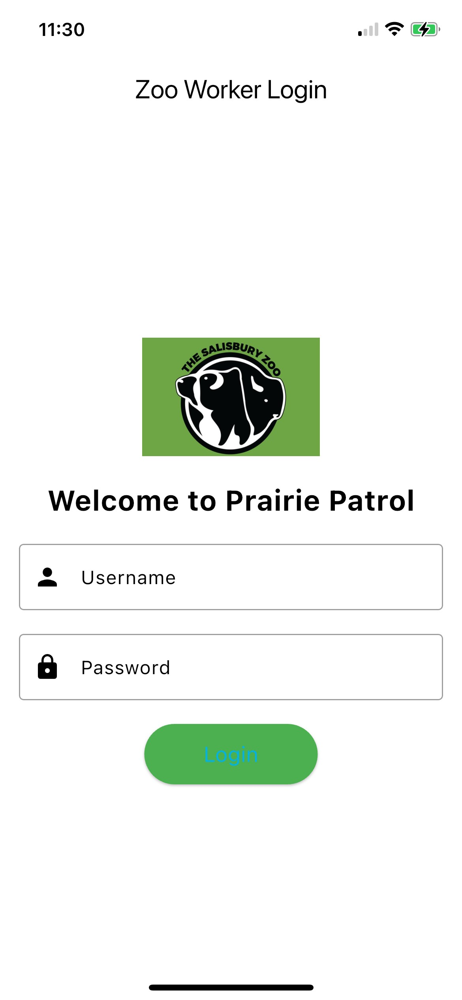
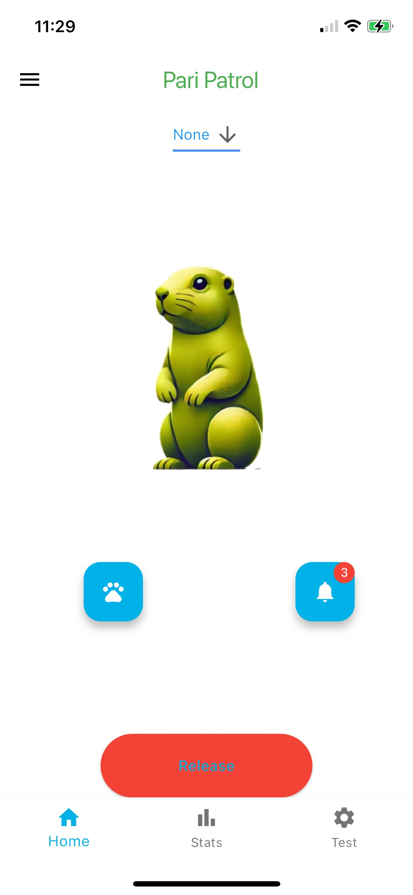

# Prairie Patrol

**Prairie Patrol** is a Flutter-based mobile application designed to work in tandem with an Arduino and Google Firebase. 
The app facilitates smart, remote-controlled trapping of prairie dogs using RFID technology to identify animals and close the 
cage only when the desired dog is detected.

This project is built to assist zookeepers or wildlife researchers with precision and automation, ensuring humane and efficient trapping.

<br />

## Features
- **RFID Integration**: Detects animals with embedded RFID tags to identify specific prairie dogs in the trap.
- **Remote Control**: Communicates with an Arduino via Firebase to control the trap's door mechanism.
- **Real-Time Updates**: Displays live notifications and trap status on the app.
- **Dark and Light Themes**: Supports both themes for user preference.
- **Customizable Settings**: Easily configure the app for your environment.

<br />
<div>
  &emsp;&emsp;&emsp;
  
  &emsp;&emsp;&emsp;&emsp;
    
</div>
<br />

---

## First Run

After installing the package dependencies with:

```bash
flutter pub get
```

Run the code generation tool:

```bash
flutter pub run build_runner build
```

## Run Configurations

The project supports multiple build modes, along with environments for testing and production:

- **debug** - Development environment for debugging.
- **profile** - Optimized for profiling.
- **release** - Optimized for production.

To run the app in debug mode, use:
```bash
flutter run
```

Or set configurations in your IDE (e.g., Android Studio or VSCode).

---

## App Configuration

### Firebase
1. Set up a Firebase project.
2. Add `google-services.json` (for Android) and `GoogleService-Info.plist` (for iOS) to the respective folders in your Flutter project.

### Arduino
1. Program the Arduino to read RFID tags and communicate with Firebase Realtime Database using code in arduinoRFID copy Folder.
2. Ensure the Arduino controls the servo motor for the cage mechanism.

---

## Hardware Configuration for the Cage Prototype with no Wifi
** to start make sure the battery is connected 
1. Download arduino onto your computer
2. plug the arduino into your computer
3. Hover over tools --> Board --> Board Manager --> install " Arduino uno R4 boards"
4. Hover over sketch--> include library--> library manager --> install mfrc 22
5. Open "testRfidNoWifi"
6. Hover over Tools --> Port --> select port that the arduino is plugged into (usually the recommened port)
7. Hover over Tools --> and click on serial monitor (this is where any text will pop up as the code runs, so keep the serial monitor visible)
8. Go back to the arduino tab, and click the circle button with upload button with the arrow in it. This should be the second button in the top left hand corner. This button uploads the 
code to the arduino.
* When the code has successfully uploaded the serial monitor should tell you that the card is ready to be scanned, simply hold a HF RFID card to the scanner and the door should close when its the selected card held up to the scanner.
* To reset the simulation just reupload the code

Note: the process is the same for running any arduino program: simply plug the arduino into the computer, then wait for the code to upload!

### Key Components
1. **RFID Scanner**: Detects the animal in the cage.
2. **Firebase**: Acts as a bridge between the Arduino and the Flutter app, syncing data in real-time.
3. **Flutter App**: Displays trap status and allows remote control.

---

## Under the Hood

### Data Management
- **TasksRepository**: Handles communication with Firebase and local data cache.
- **ApiService**: Provides an abstraction for Firebase communication.


## Usage

This app is built for zookeepers or wildlife researchers looking for an automated solution to trap specific prairie dogs humanely and efficiently.


---

## Contributors

- **Connor Sullivan** (Project Leader)
- **Will Webber** (Software Developer)
- **Noah Webb** (Software Developer)
- **Ashley Gerbes** (Hardware Developer)
- **Jude Maggitti** (Hardware Developer)

---

## License

This project is licensed under the MIT License. See the LICENSE file for details.
